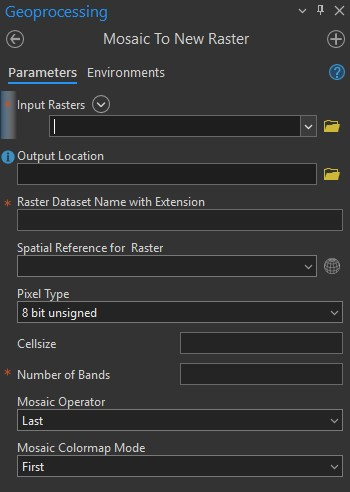
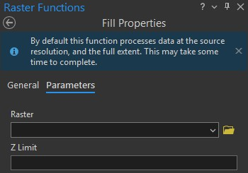
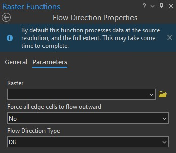
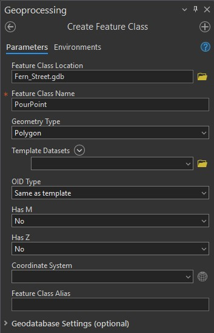
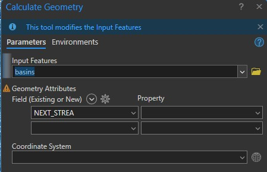
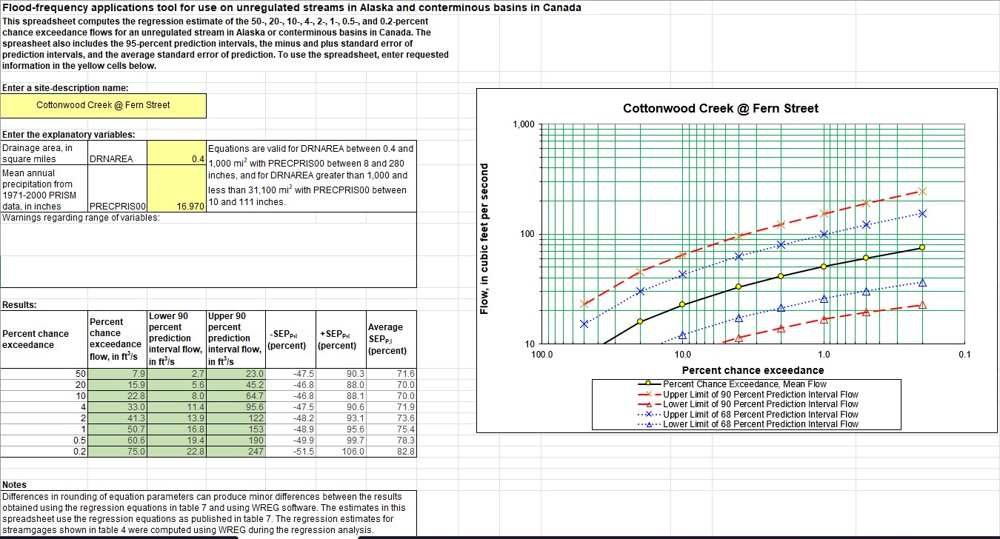

# Fish Passage Culvert Analysis

As a first order analysis to determine if an existing culvert is sufficient for fish passage this is the workflow that I have performed.

## Step 1 Define Drainage Basin

For this project I used the 2019 USGS 3DEP MatSu Borough 1-meter Lidar data set. This data can be downloaded from "https://prd-tnm.s3.amazonaws.com/index.html?prefix=StagedProducts/Elevation/OPR/Projects/AK_MatSuBorough_2019_B19/AK_MatSuBorough_B1_2019/TIFF/"

After downloading tiff's from this link, I used Arc Gis Pro to stitch together the multiple files into a single tiff file. To do this, I used the "Mosaic To New Raster" geoprocessing tool. 

{width=400px style="margin-bottom: 1em;"}

Once the new raster is created, I used the "Raster Functions" in Arc to perform a Fill on the raster. This step shouldn't be overlooked. Using a fill value that is too large will cross drainage boundaries and can lead to catchment areas much larger than reality. When performing this step I will do multiple trials to determine what seems to match reality.

{width=400px style="margin-bottom: 1em;"}

With the sinks of the raster now filled, the next step is to perform a "Flow Direction" raster function. I don't force the cells to flow outward and I keep the Flow Direction Type as D8.

{width=400px style="margin-bottom: 1em;"}

Now I use the geoprocessing tool "Create Feature Class" to create an empty feature class named "PourPoint". In the ribbon of ArcGisPro, I move to the Edit tab and with the PourPoint feature class selected in the Contents, select create from the ribbon options and choose multipoint and drop points at the outlet location you want to model.

{width=400px style="margin-bottom: 1em;"}

Lastly, run the "Watershed" geoporcessing tool with the Flow Direction and pour point layers from earlier and specifu the file path of the output watershed raster.

{width=400px style="margin-bottom: 1em;"}

With the defined basin it is important to obtain the area. To do this, open the attribute table and the ribbon will change with the added tab of Table. Go to this tab and add a field. Name it something descriptive like Area_acres, set the Data Type to Double and the Number Format to Numeric. Go back to the attribute table and right-click the new column of Area_acres and choose calculate geometry, for the property choose area (geodesic) and the Area Unit of US Survey Acres and the correct coordinate system.

{width=400px style="margin-bottom: 1em;"}

## Step 2: Determine 2-year 24-hour Peak Flow

There are multiple ways to determine this flow, this example will follow the USGS Regression method, but it can also be acheived by using the NRCS TR-55 method.

To obtain the 2-year 24-hour flow, the data input include the drainage area and the mean annual precipitation from 1971-2000 PRISM data in inches. I was able to find rasters for every month and then performed a zonal statistics with the boundary of my basin and create a mean annual precipitation estimate with these. Link to rasters "https://catalog.snap.uaf.edu/geonetwork/srv/api/records/59dc58a7-57b8-447a-8a6f-d17661c41b1e"

{width=400px style="margin-bottom: 1em;"}
