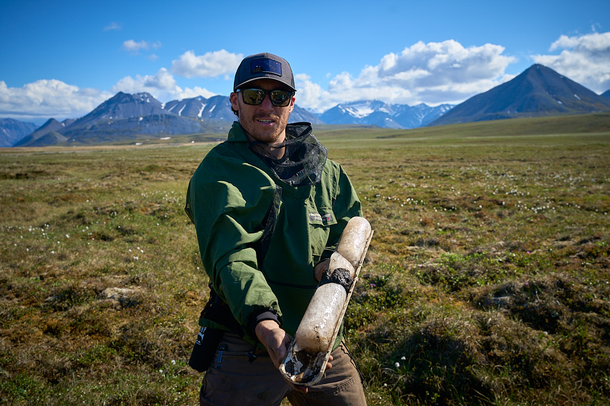

--- 
title: "Gabe's Guide to Engineering"
author: "Gabe Benitez"
date: "`r Sys.Date()`"
site: bookdown::bookdown_site
output:
  bookdown::bs4_book: default   # or bookdown::gitbook
documentclass: book
bibliography:
  - book.bib
  - packages.bib
description: >
  This is a living document that is meant to host workflows that I do on engineering projects.
link-citations: true
github-repo: "rstudio/bookdown-demo"
---
# Introduction {#intro}

My name is Gabe Benitez and I am a Water Resources Engineer-in-Training (EIT) with a goal of developing a living document to share the workflows I use on engineering projects. This guide also serves as a record of lessons learned and opportunities for improvement to help refine my processes over time.

## About me
{width=400px style="margin-bottom: 1em;"}

I grew up in Anoka, Minnesota, and earned my Bachelor of Science in Environmental Sciences, Policy, and Management with a minor in Soil Science from the University of Minnesota Twin Cities. My undergraduate studies focused on landscape-scale processes, particularly pedogenesis—the formation and development of soils. During this time, I was an active member and captain of the University of Minnesota Soil Judging Team from 2017 to 2020. More information about the team can be found at https://umnsoilsteam.blogspot.com/
.

After completing my undergraduate degree, I pursued my goal of becoming an engineer at Utah State University, where I earned a Master of Science in Civil and Environmental Engineering. While at the Utah Water Research Laboratory (https://uwrl.usu.edu/
), I conducted research under Dr. Colin Phillips focused on sediment dynamics in fluvial systems and how these processes shape river morphology using high-resolution LiDAR. My thesis can be found at https://digitalcommons.usu.edu/etd2023/444/
.

Following my master’s degree, I took a break from computer-based research and joined the Natural Resources Conservation Service (NRCS) as a Soil Scientist, conducting initial soil mapping across the great state of Alaska. This work brought me to many incredible places, including the Copper River Basin, Yukon-Kuskokwim Delta, Arctic Coastal Plain, and many locations in between. After three rewarding years with the federal government, a change in administration prompted me to transition out of the public sector.

Today, I am continuing my professional journey as an engineer—bringing together my background in earth sciences and engineering to solve complex environmental and infrastructure challenges.

```{r map-waypoints, echo=FALSE, message=FALSE}
library(leaflet)

# Waypoints
places <- data.frame(
  name = c(
    "Anoka, Minnesota",
    "University of Minnesota",
    "Utah State University",
    "Palmer, Alaska",
    "St. Mary's, Alaska",
    "Glennallen, Alaska",
    "Inigok Field Station"
  ),
  lat = c(45.1978, 44.9750, 41.7377, 61.600803, 62.0405, 62.1055, 70.003831),
  lng = c(-93.3872, -93.23528, -111.8087, -149.125259, -163.2178, -145.5412, -153.077568)
)

leaflet(places) |>
  addProviderTiles(providers$Esri.WorldImagery, group = "Imagery") |>   # 🛰️ Satellite imagery
  addProviderTiles(providers$OpenStreetMap, group = "Street Map") |>    # 🗺️ Optional secondary layer
  addLayersControl(
    baseGroups = c("Imagery", "Street Map"),
    options = layersControlOptions(collapsed = FALSE)
  ) |>
  addCircleMarkers(
    lng = ~lng, lat = ~lat,
    radius = 7, stroke = TRUE, weight = 2, opacity = 1,
    fillOpacity = 0.8, color = "white", fillColor = "red",
    label = ~name,
    popup = ~sprintf("<b>%s</b><br/>%.4f, %.4f", name, lat, lng)
  ) |>
  addScaleBar(position = "bottomleft") |>
  fitBounds(
    lng1 = min(places$lng), lat1 = min(places$lat),
    lng2 = max(places$lng), lat2 = max(places$lat)
  )
```

## Disclaimer 

The information and workflows in this book are provided for general educational and informational purposes only. I make no warranties about their completeness, reliability, or accuracy. Use of these methods is at your own risk. I am not liable for any loss, damage, or injury resulting from the application of these workflows.
